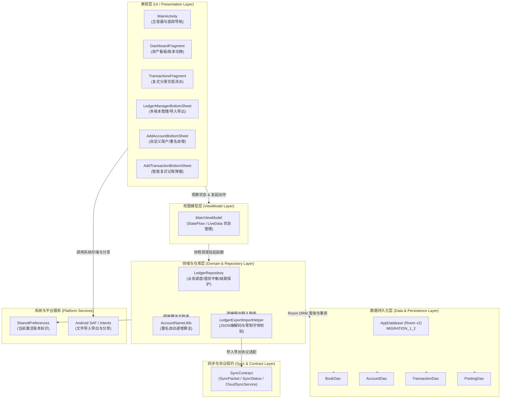
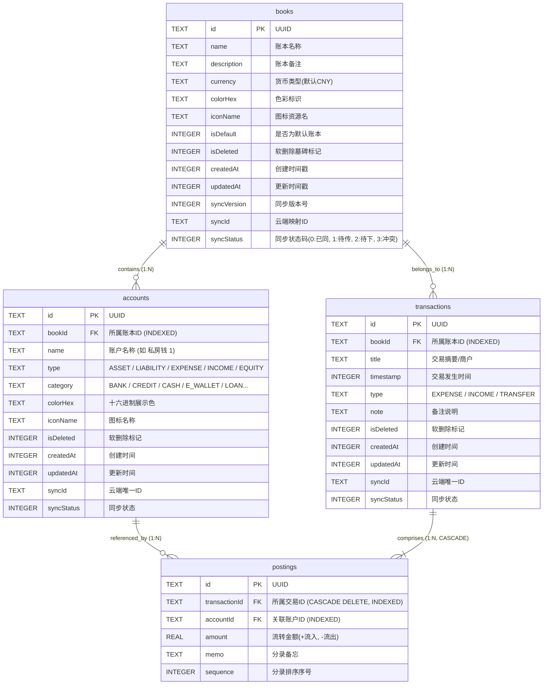
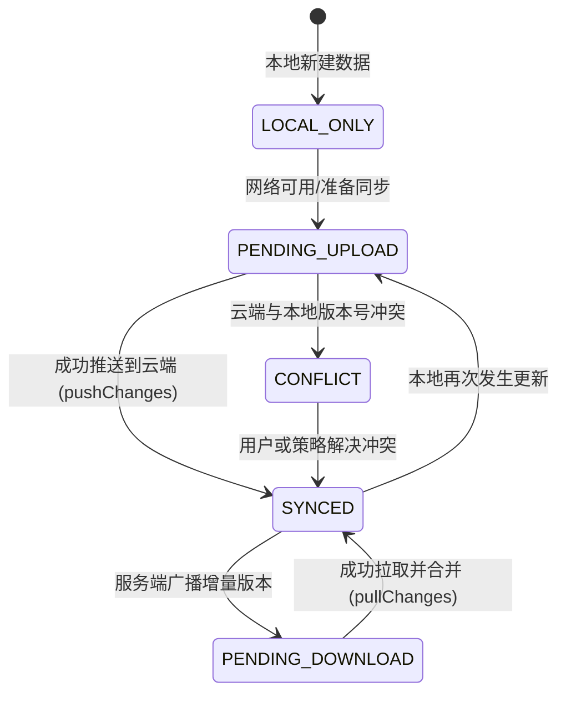

# FlowLedger 系统架构设计与技术全景规范 (ARCHITECTURE.md)

本文档阐述 **FlowLedger (多账户资金流转记账系统)** 的全景系统架构、核心数学模型、数据流拓扑、数据库 Schema 设计规范以及为未来云同步与多端互联预留的扩展协议。

---

## 一、 架构设计哲学与核心理念

现代个人财务管理中，资金往往分散并流转于微信支付、支付宝、多张借记卡、信用卡、花呗、白条与各类投资账户之间。传统记账软件将交易强制离散化为单一的“收入”或“支出”，导致信用卡还款虚增支出、转账手续费丢失、账户余额失真等结构性痛点。

FlowLedger 确立了以下五大工程与设计公理：

1. **复式分录图模型（Double-entry Graph Model）**：
   每一笔经济行为本质上是资金在账户节点之间的有向流动。系统基于复式记账法建模，任何交易必须满足资金零和守恒，彻底杜绝孤立数据。
2. **离线优先（Offline-First）**：
   所有读写操作均在本地端（SQLite / Room）即时完成，提供亚毫秒级的交互响应，网络不可用时功能完全零损失。
3. **数据主权与开放互通（Data Sovereignty & Portability）**：
   用户完全掌控自身数据，支持通过 Android Storage Access Framework (SAF) 进行标准结构化 JSON 格式的无损导出与校验导入。
4. **无损云同步就绪（Cloud Sync Readiness）**：
   在底层持久化层天然植入全局唯一 UUID、版本时间戳（`syncVersion`）、同步状态标记（`syncStatus`）以及墓碑软删除机制（`isDeleted`），为分布式多端同步奠定架构基础。
5. **轻量化与高内聚**：
   摒弃冗余的重型框架依赖，拥抱现代 Android Jetpack 核心组件（Room, ViewModel, StateFlow, ViewBinding, Material 3）。

---

## 二、 分层系统架构 (System Layered Architecture)

FlowLedger 采用清晰的现代 Android MVVM (Model-View-ViewModel) 分层架构，各层之间单向依赖，高内聚低耦合：



---

## 三、 核心数学模型与资金守恒公理

### 1. 账户节点五大类划分

系统将所有财务参与主体抽象为五类有向图节点（`AccountType`）：

| 节点类型 (`AccountType`) | 符号方向 | 典型账户范例 | 正常余额性质 | 资产负债表归属 |
| :--- | :---: | :--- | :---: | :--- |
| **`ASSET` (资产)** | 流入 $(+)$ / 流出 $(-)$ | 银行储蓄卡、微信零钱、支付宝余额、现金钱包、理财账户 | 正数（借方余额） | 资产总计 (Assets) |
| **`LIABILITY` (负债)** | 流入 $(+)$ / 流出 $(-)$ | 信用卡、花呗、京东白条、银行贷款、应付款 | 负数（贷方余额） | 负债总计 (Liabilities) |
| **`EXPENSE` (支出)** | 流入 $(+)$ | 餐饮、交通、购物、娱乐、**提现手续费**、还款手续费 | 正数（累计消耗） | 损益表 (P&L) |
| **`INCOME` (收入)** | 流出 $(-)$ | 工资薪金、投资分红、理财收益、兼职所得 | 负数（累计源泉） | 损益表 (P&L) |
| **`EQUITY` (权益)** | 流出 $(-)$ | 初始账户资产注入（期初平账）、所有者权益 | 负数（原始投入） | 净资产对冲 |

### 2. 资金守恒定理 (Conservation Law of Money)

每一笔交易 $T$ 由包含 $n$ 个分录节点的有序集合 $P = \{p_1, p_2, \dots, p_n\}$ 组成，满足代数零和约束：

$$\sum_{i=1}^{n} p_i.\text{amount} = 0 \quad (n \ge 2)$$

* $p_i.\text{amount} < 0$：资金自节点 $i$ 流出；
* $p_i.\text{amount} > 0$：资金向节点 $i$ 流入。

### 3. 动态余额与净资产计算推导

为杜绝传统记账在并发或修改历史数据时发生“余额悬空”，FlowLedger **不在账户实体中固化当前余额字段**，而是基于 SQLite 聚合函数动态推导：

$$\text{Balance}(\text{Account}_k) = \sum_{p \in \text{Postings}, p.\text{accountId} = k} p.\text{amount}$$

净资产（Net Worth）计算公式：

$$\text{NetWorth} = \sum_{a \in \text{ASSET}} \text{Balance}(a) + \sum_{l \in \text{LIABILITY}} \text{Balance}(l)$$

> [!NOTE]
> 负债账户的欠款在计算中体现为负数，因此总资产（$\sum \text{ASSET}$）加上负债（负数）自然等于真实净资产，完全符合会计恒等式：$$\text{资产} = \text{负债} + \text{所有者权益}$$。

---

## 四、 数据库架构与 Schema 设计 (Room v2)

系统采用 Room 持久化库管理本地 SQLite。在版本 2（`v2`）中引入了完整的「多账本体系」与「软删除墓碑机制」：

### 1. 实体关系图 (Entity Relationship Diagram)



### 2. 数据库平滑迁移策略 (`MIGRATION_1_2`)

当用户从 v1 升级至 v2 时，[`AppDatabase.kt`](file:///D:/book/app/src/main/java/com/flowledger/app/data/AppDatabase.kt) 执行原子级 SQL 事务迁移：
1. **新建 `books` 表** 并初始化默认账本记录：`id='default_book_id'`, `name='默认账本'`;
2. **扩充 `accounts` 表**：增加 `bookId`、`isDeleted`、`syncId`、`syncStatus` 字段，并将所有历史账户外键回填为 `default_book_id`；
3. **扩充 `transactions` 表**：增加 `bookId`、`isDeleted`、`syncId`、`syncStatus` 字段，历史交易全量绑定到 `default_book_id`；
4. **重建复合索引**：针对 `accounts(bookId)`、`transactions(bookId)`、`postings(transactionId)` 创建专用索引，保证动态多账本筛选下的毫秒级检索。

---

## 五、 关键算法与业务流转设计

### 1. 重名账户智能自增编号算法 (`AccountNameUtils`)

为了支持用户自由添加自定义账户并无缝处理重名情况，系统设计了无状态纯函数算法 [`AccountNameUtils.generateUniqueAccountName`](file:///D:/book/app/src/main/java/com/flowledger/app/utils/AccountNameUtils.kt)：

* **输入**：用户期望名称 `requestedName`，当前账本已有账户集合 `existingNames`；
* **流程**：
  1. 去除首尾空格，若不存在冲突则直接返回；
  2. 正则提取输入的基准名称与可能自带的序号：`^(.*?)(?:\s+(\d+))?$`；
  3. 扫描库中匹配 `^{baseName}(?:\s+(\d+))?$` 的所有现有名称，提取已占用的数字集合 $\mathcal{U} \subset \mathbb{N}$；
  4. 自 $k=1$ 起线性探测第一个未占用的正整数 $k \notin \mathcal{U}$；
  5. 拼接输出 `"$baseName $k"`。
* **特性**：
  - 支持填补编号空档（例如已有“私房钱”、“私房钱 2”，再次添加“私房钱”将精准分配“私房钱 1”）；
  - 时间复杂度 $\mathcal{O}(M)$，其中 $M$ 为当前账本下匹配同名基准的账户数量（通常 $< 100$），算法耗时 $< 0.1\,\text{ms}$。

### 2. 经典多节点业务流转模型

```
[场景：微信提现到工商银行卡，收取手续费 1 元]

        +-----------------------+
        |   微信零钱 (ASSET)     |
        |   -1001.00 元         |
        +-----------+-----------+
                    |
                    +------------------------------------+
                    | 资金流向                            | 资金流向
                    v                                    v
        +-----------------------+            +-----------------------+
        |  工行储蓄卡 (ASSET)   |            | 提现手续费 (EXPENSE)  |
        |  +1000.00 元          |            | +1.00 元              |
        +-----------------------+            +-----------------------+

        代数和验证: (-1001.00) + (+1000.00) + (+1.00) == 0.00 (借贷守恒成立)
```

### 3. 全量账本导入导出与格式规范 (`LedgerExportImportHelper`)

系统导出包为自描述 JSON 结构：
```json
{
  "formatVersion": 1,
  "app": "FlowLedger",
  "exportedAt": 1727511080000,
  "book": {
    "id": "book-uuid-xxx",
    "name": "日常家庭账本",
    "currency": "CNY"
  },
  "accounts": [ ... ],
  "transactions": [
    {
      "transaction": { "title": "超市购物", ... },
      "postings": [
        { "accountId": "acc-1", "amount": -150.0 },
        { "accountId": "acc-2", "amount": 150.0 }
      ]
    }
  ]
}
```

* **导入时 ID 重映射机制（UUID Remapping）**：
  为避免跨设备或同一设备重复导入时发生主键冲突，导入流程生成新的 `bookId`，并建立映射字典 $\text{Map}\langle \text{oldAccId}, \text{newAccId}\rangle$。重排所有交易与分录的外键。
* **导入强校验防线**：
  对导入包中每一笔交易执行 $\left|\sum p_i.\text{amount}\right| < 10^{-4}$ 浮点容差校验，任何不平账数据立即拒绝导入并回滚事务。

---

## 六、 云同步协议与扩展空间设计 (`SyncContract`)

系统已在架构层完全抽象出客户端与远端数据同步契约 [`SyncContract.kt`](file:///D:/book/app/src/main/java/com/flowledger/app/sync/SyncContract.kt)：

### 1. 同步状态机 (Sync Status)



### 2. 墓碑软删除（Tombstone-driven Deletion）

当用户在本地删除账本、账户或交易时，记录不会立即被物理擦除，而是置位 `isDeleted = true` 并提升 `syncVersion`。在云同步数据包 `SyncPacket` 中，被删除实体的 ID 汇入 `deletedIds: List<String>`。远端与其它同步节点收到后，同步执行级联软删除，避免离线重传时“僵尸数据复活”。

---

## 七、 表现层设计与 Material 3 主题规范

* **浅色 / 深色模式语义化色彩系统**：
  通过 `res/values/colors.xml` 与 `res/values-night/colors.xml` 实现全量 Token 化。
  - 背景色：浅色 `#F5F7FA` $\leftrightarrow$ 深色 `#121316`；
  - 卡片表面：浅色 `#FFFFFF` $\leftrightarrow$ 深色 `#1E2024`；
  - 重点文本对比度：深色模式下主文字为高光 `#F1F3F5`，次级文字为 `#A0A5AC`；
  - 财务强调色：收入/资产绿色 `#388E3C` / `#4CAF50`，支出/负债红色 `#D32F2F` / `#EF5350`，调拨蓝色 `#1976D2` / `#42A5F5`。
* **组件化交互架构**：
  所有表单交互均通过 Material 3 `BottomSheetDialogFragment` 承载，提供流畅的底部滑出体验，支持软键盘自适应平移（`SOFT_INPUT_ADJUST_RESIZE`）。
